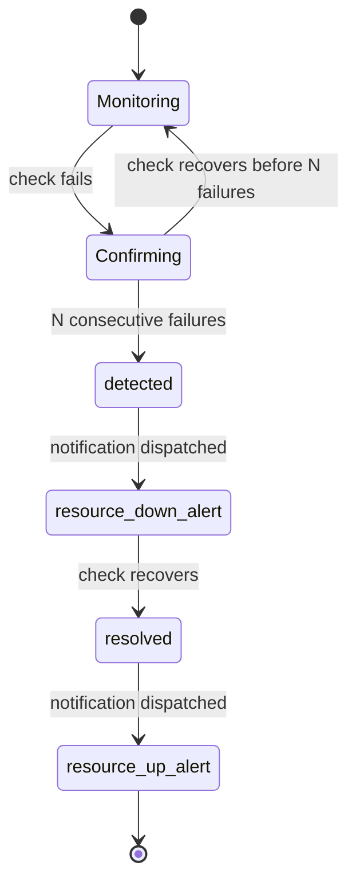

# Incidents & confirmation

## Why confirmation

Most monitoring tools alert on the first failed check. Ogoune confirms failures before creating an incident — the difference between a real outage and a 2-second blip.

## Confirmation window

A monitor opens an incident only after **N consecutive failed checks**. Until then, failures are recorded but no alert fires.

## Flap detection

Rapidly alternating up/down states are damped so you don't get an alert storm from a flapping service.

## Alert grouping

Related failures are grouped so a single upstream outage doesn't produce dozens of separate pages.

## Lifecycle steps

`detected` · `resource_down_alert` · `resolved` · `resource_up_alert` — steps may not all be present for every incident.

::: tip
Not every incident carries all four steps — e.g. a resolved incident with no configured
notification channel skips the alert steps but still records `detected` and `resolved`.
:::
